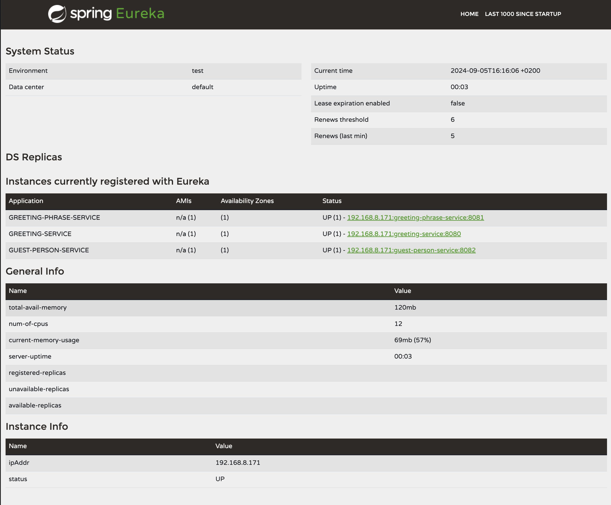
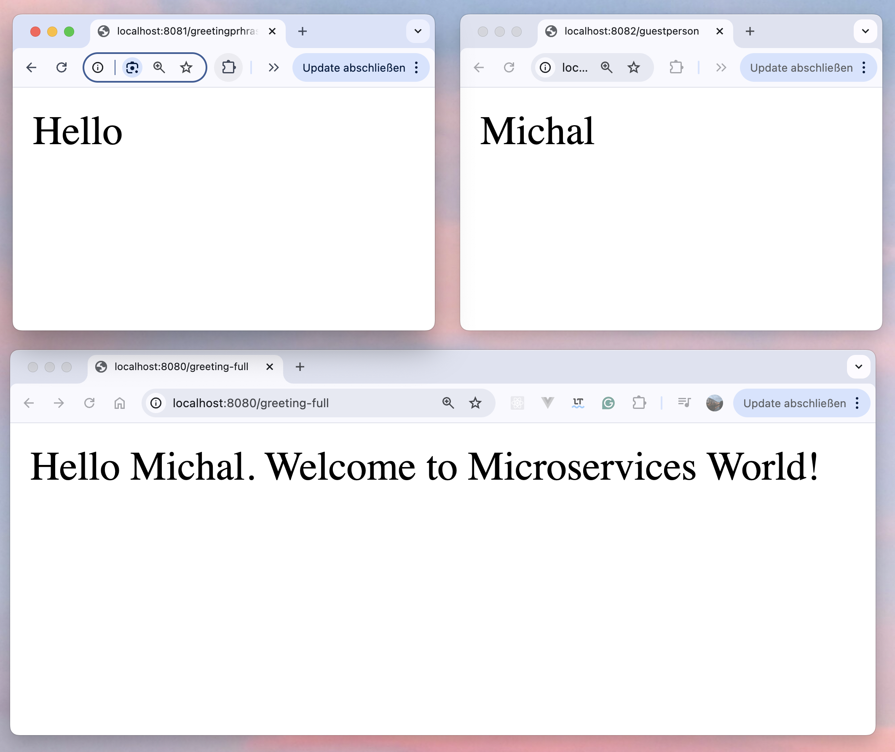
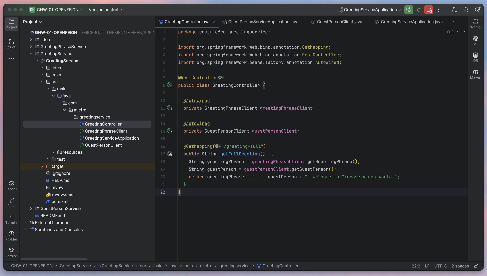
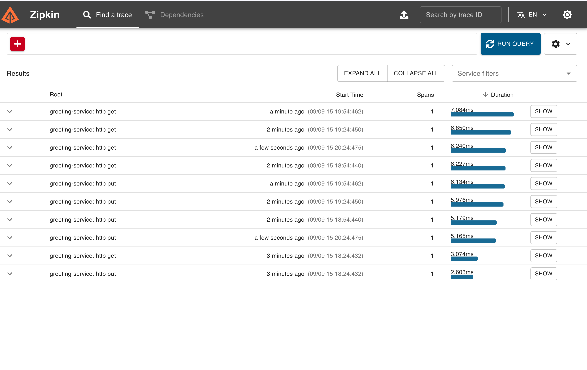

# Spring Boot Microservices Example

This project demonstrates a microservices architecture using Spring Boot, including the following components:

- **GreetingService** - Combines the responses of `GreetingPhraseService` and `GuestPersonService` to form a full greeting (`Hello World`).
- **Eureka Server** - Service registry for discovering microservices.
- **Spring Cloud Gateway** - API gateway for routing requests to the microservices.
- **Distributed Tracing** - Enabled with **Micrometer Tracing** and **Zipkin** for tracking request flows between services.

## Prerequisites

- **Java 17** or higher
- **Maven** 3.6+
- **Docker** (for running Zipkin)

## How to Run the Application

### 1. Clone the repository
```bash
git clone <repository-url>
cd <repository-directory>
```

### 2. Build the project
```bash
mvn clean install
```

### 3. Start Eureka Server
First, start the Eureka Server, which will act as the service registry:
```bash
cd eureka-server
mvn spring-boot:run
```

Eureka will be accessible at `http://localhost:8761`.

### 4. Start the Microservices
Each microservice needs to be started separately. Open new terminal windows or tabs for each of the services and run:

#### GreetingPhraseService
```bash
cd greeting-phrase-service
mvn spring-boot:run
```

#### GuestPersonService
```bash
cd guest-person-service
mvn spring-boot:run
```

#### GreetingService
```bash
cd greeting-service
mvn spring-boot:run
```

### 5. Start the API Gateway
The API Gateway will route requests to the appropriate microservices:

```bash
cd gateway-service
mvn spring-boot:run
```

### 6. Start Zipkin (for Distributed Tracing)
If you have Docker installed, you can run Zipkin using the following command:
```bash
docker run -d -p 9411:9411 openzipkin/zipkin
```

Zipkin will be available at `http://localhost:9411`.

### 7. Access the Services via Gateway
The following endpoints are exposed through the Gateway:

- **GreetingPhraseService**: `http://localhost:8083/greeting`
- **GuestPersonService**: `http://localhost:8083/guest`
- **GreetingService**: `http://localhost:8083/greeting-full`

### 8. Distributed Tracing with Zipkin
After sending some requests to the services via the API Gateway, you can view the distributed tracing data in Zipkin.

Open your browser and go to `http://localhost:9411`. Use the "Find Traces" button to see the trace data.

## Configuration Overview

### Eureka Server Configuration (`application.yml`)
```yaml
server:
  port: 8761
eureka:
  client:
    register-with-eureka: false
    fetch-registry: false
```

### Microservices Configuration (`application.yml`)
Each microservice has a similar configuration that enables Eureka Client, distributed tracing with Zipkin, and logging.

Example for `greeting-service`:
```yaml
server:
  port: 8080
spring:
  application:
    name: greeting-service
  cloud:
    gateway:
      discovery:
        locator:
          enabled: true
  sleuth:
    sampler:
      probability: 1.0
  zipkin:
    base-url: http://localhost:9411
    enabled: true
eureka:
  client:
    service-url:
      defaultZone: http://localhost:8761/eureka/
```

## Additional Features

- **Logging**: SLF4J logging has been added to each microservice to log incoming requests and responses.
- **Load Balancing**: Spring Cloud Gateway is set up to load balance between services automatically using Eureka.


### Autor
Created by Michal Frost

### Screenshots








